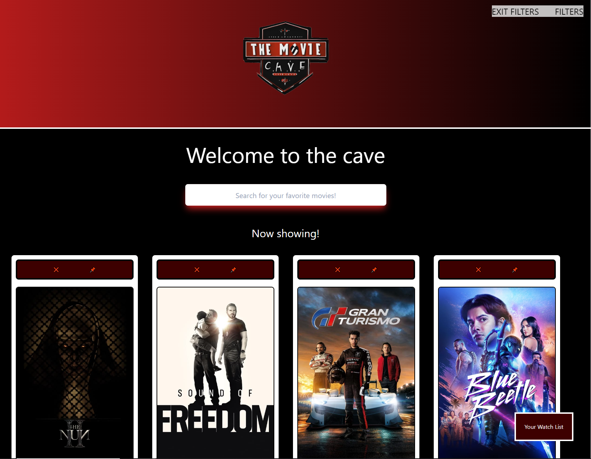
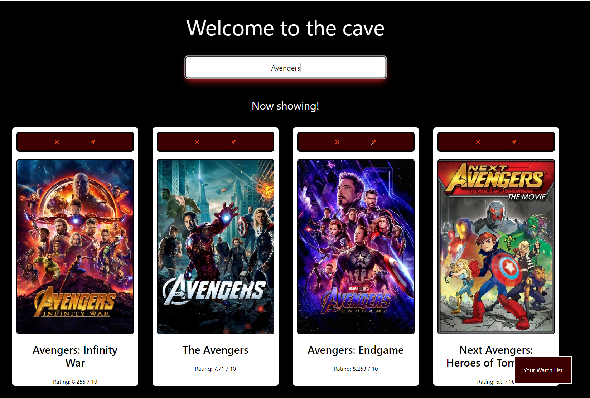

# movie-project

## Description

"The Movie Cave" is a collaborative project between myself and 3 of my classmates, which will be credited in the description.

Our motivation to create TMC was to create a more streamlined/easier way to view movies, release dates, and information about said movies, since current existing services have a clunky and slow UI/UX design.

## Installation

The application should run flawlessly within any modern browser/

## Usage

Upon loading the page, you will be greeted with a selection of new or up-and-coming movies:

You can utilize the search bar to look for different movies:

Or you can select a show movie to see more information on it:

There is also a currently WIP watchlist function which will be implemented soon!

## Credits

Jakob Pfiefer: https://github.com/jakobpfeifer135
Austin Tynes: https://github.com/austintynes
Joshua Payne: https://github.com/JoshPayne1
